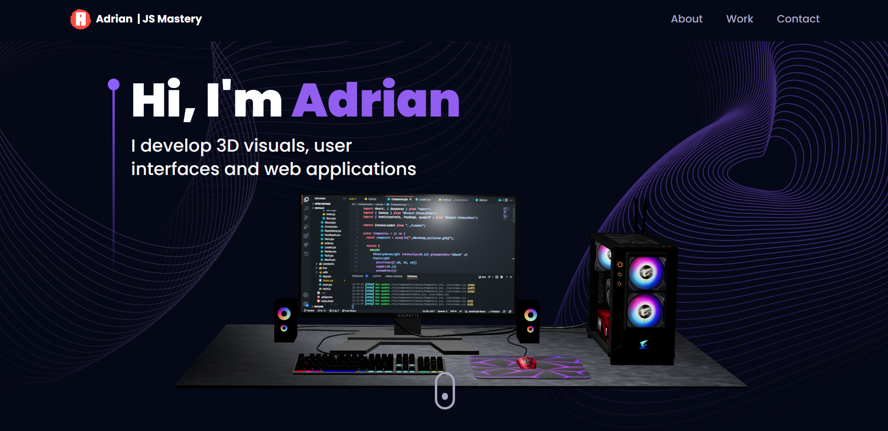
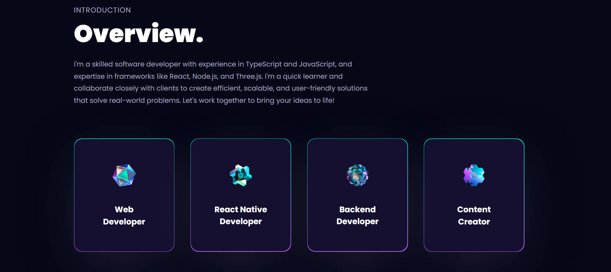
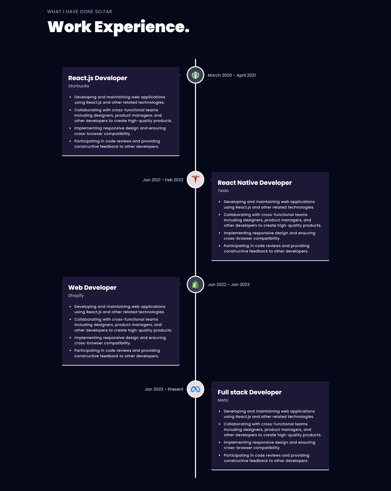
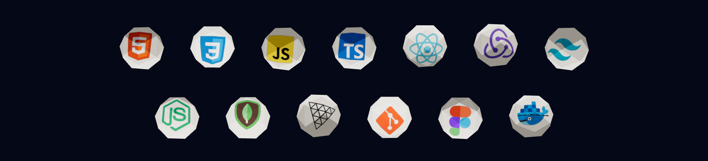
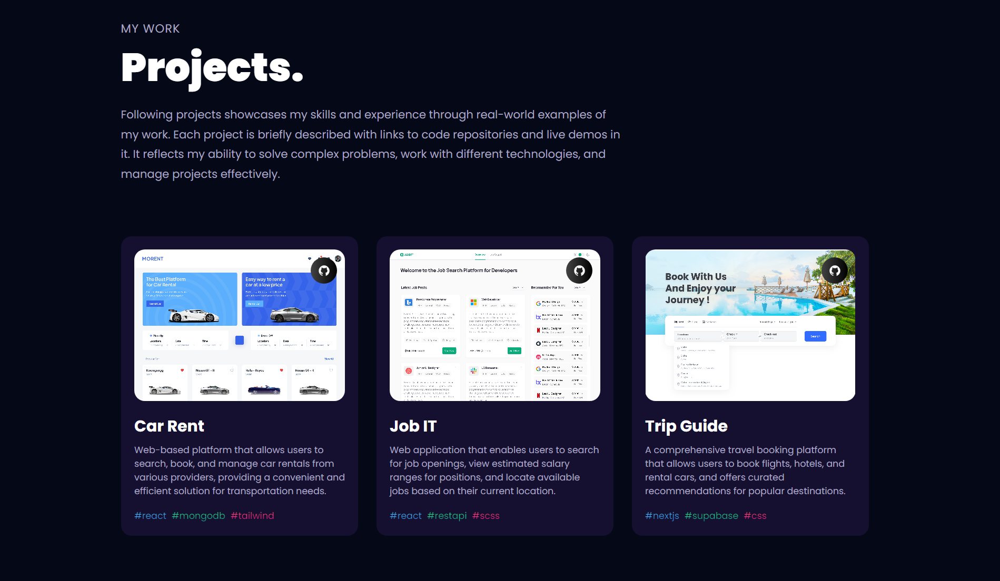
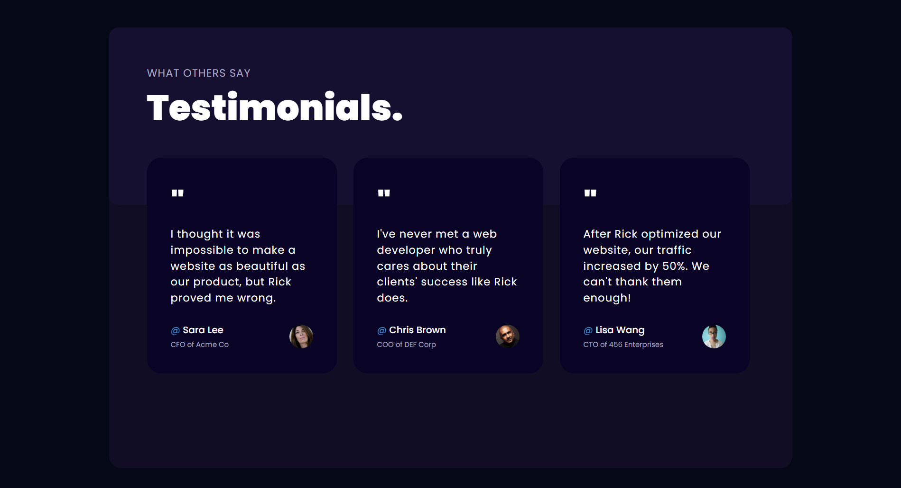
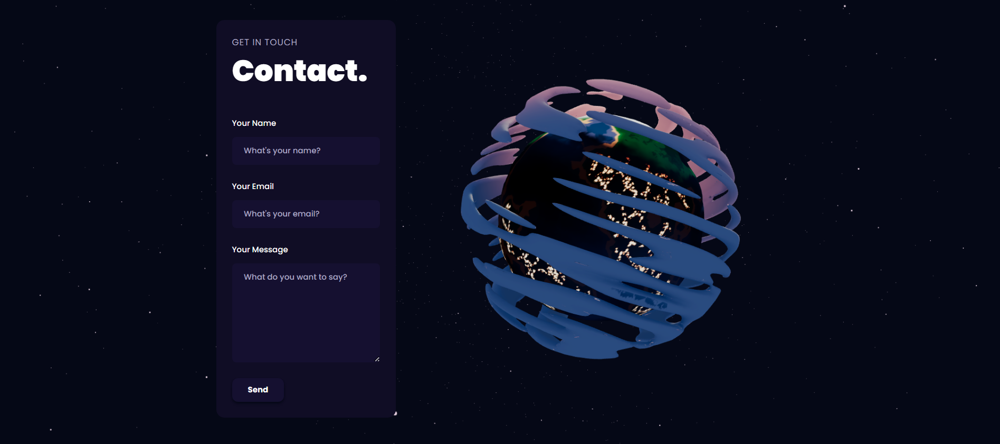

# Portfolio 3D Website Using React
This design is inspired by this [video](https://youtu.be/0fYi8SGA20k), which belongs to [JavaScript Mastery](https://www.youtube.com/@javascriptmastery).

## Technologies
This web page was made with the following technologies:
- HTML5
- CSS3
- JavaScript
- React
- EmailJS
- React Three
- Maath
- React DOM
- React Router DOM
- React Tilt
- React Vertical Timeline Component
- Three
- Tailwind CSS

## Pages
This web page contains 7 sections: **Hero**, **About**, **Experience**, **Tech**, **Works**, **Feedbacks** and **Contact**.

### Hero
#### In this section you will see the title of the portfolio and a short description. Also, you will see a 3D image that you can rotate. And a button that directs you to the next section.

### About
#### In this section, you'll see a subtitle, section title, and description. In addition, you will see the areas that I have knowledge.

### Experience
#### In this section you will see work experience, companies, position and functions.

### Experience
#### In this section you will see the technologies learned.

### Works
#### In this section, you'll see a subtitle, section title, and description. In addition, you will see the projects that I have carried out.

### Feedbacks
#### In this section, you will see the testimony of some people who worked with me.

### Contact
#### In this section, you will see a functional form and on the right side you will see a 3D image which you can rotate.

